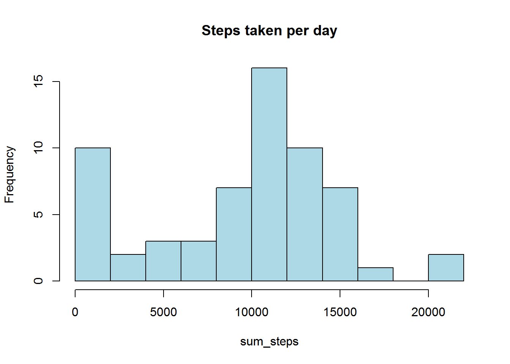
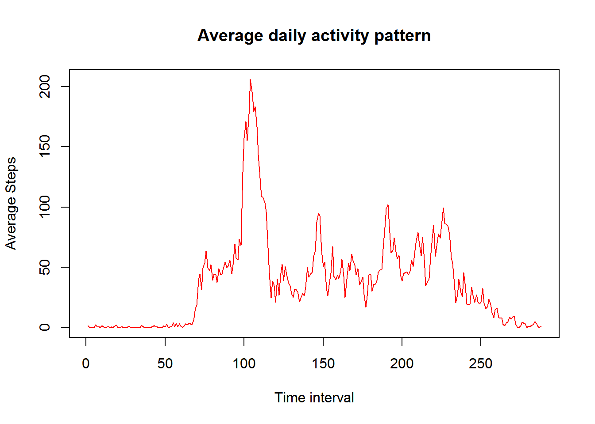
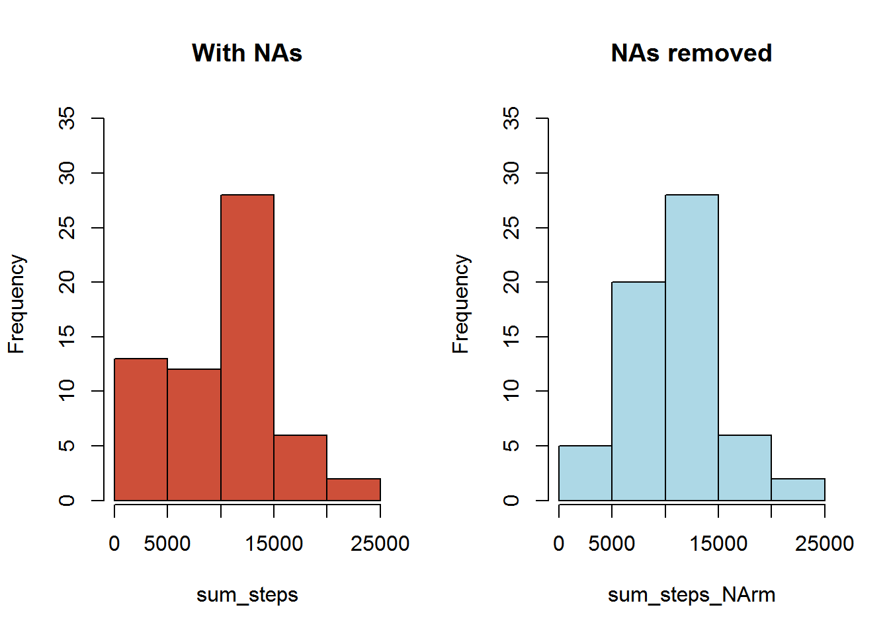
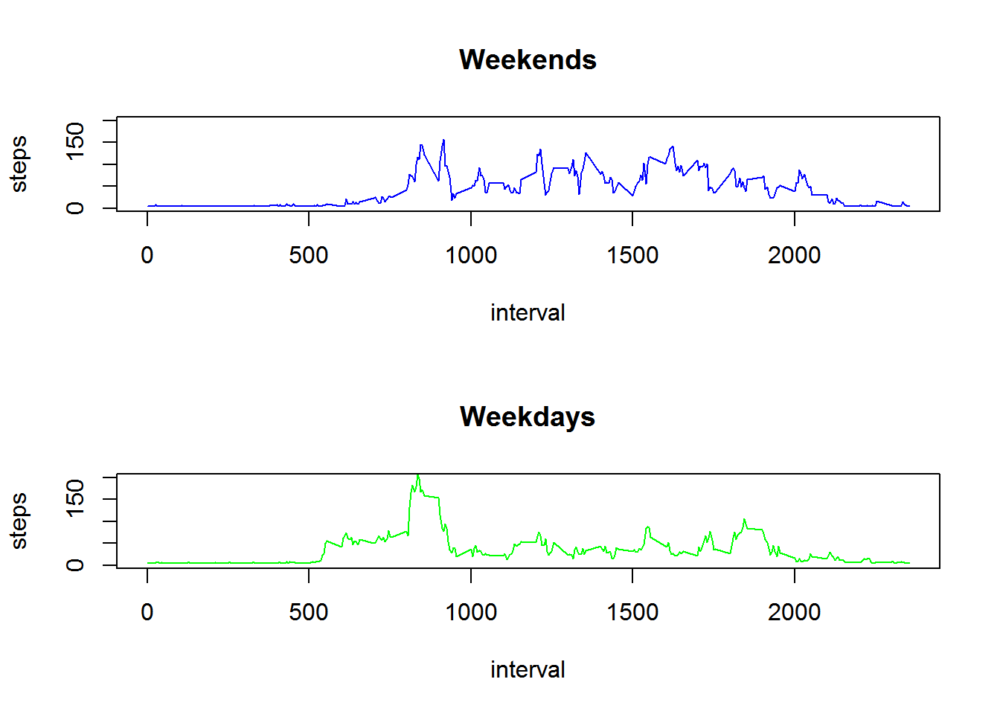

## About the project

We are required to (1) download, (2) preprocess , (2) analyze the data in order to written and graphically answer some questions.


# 1. Download dataset


```r
download.file("https://d396qusza40orc.cloudfront.net/repdata%2Fdata%2Factivity.zip",
              quiet = TRUE, 
              destfile = "./Data.zip" , method = "wininet")
```

Unzip files


```r
unzip("Data.zip")
```

## 2. Reading file


```r
activity <- read.csv("activity.csv")
summary(activity)
```

```
##      steps                date          interval     
##  Min.   :  0.00   2012-10-01:  288   Min.   :   0.0  
##  1st Qu.:  0.00   2012-10-02:  288   1st Qu.: 588.8  
##  Median :  0.00   2012-10-03:  288   Median :1177.5  
##  Mean   : 37.38   2012-10-04:  288   Mean   :1177.5  
##  3rd Qu.: 12.00   2012-10-05:  288   3rd Qu.:1766.2  
##  Max.   :806.00   2012-10-06:  288   Max.   :2355.0  
##  NA's   :2304     (Other)   :15840
```

## 3. Fixing data 


```r
activity$days <- weekdays(as.Date(activity$date))
activity$datetime<- as.POSIXct(activity$date, format = "%Y-%m-%d")
head(activity)
```

```
##   steps       date interval          days   datetime
## 1    NA 2012-10-01        0 segunda-feira 2012-10-01
## 2    NA 2012-10-01        5 segunda-feira 2012-10-01
## 3    NA 2012-10-01       10 segunda-feira 2012-10-01
## 4    NA 2012-10-01       15 segunda-feira 2012-10-01
## 5    NA 2012-10-01       20 segunda-feira 2012-10-01
## 6    NA 2012-10-01       25 segunda-feira 2012-10-01
```

```r
str(activity)
```

```
## 'data.frame':	17568 obs. of  5 variables:
##  $ steps   : int  NA NA NA NA NA NA NA NA NA NA ...
##  $ date    : Factor w/ 61 levels "2012-10-01","2012-10-02",..: 1 1 1 1 1 1 1 1 1 1 ...
##  $ interval: int  0 5 10 15 20 25 30 35 40 45 ...
##  $ days    : chr  "segunda-feira" "segunda-feira" "segunda-feira" "segunda-feira" ...
##  $ datetime: POSIXct, format: "2012-10-01" "2012-10-01" ...
```

# Actual Analysis


```r
sum_steps <- tapply(activity$steps, activity$date, sum, na.rm = TRUE)
head(sum_steps)
```

```
## 2012-10-01 2012-10-02 2012-10-03 2012-10-04 2012-10-05 2012-10-06 
##          0        126      11352      12116      13294      15420
```

### 4. What is mean total number of steps taken per day?


```r
hist(sum_steps, col = "lightblue",  breaks = 10, 
     main = "Steps taken per day")
```



Mean and median steps per day


Mean:

```r
mean_steps_day
```

```
## [1] 9354.23
```

Median:

```r
median_steps_day
```

```
## [1] 10395
```

## 5. What is the average daily activity pattern?


```r
avrg_steps<- tapply(activity$steps,activity$interval, mean, na.rm = TRUE)

avrg_steps[1:10]
```

```
##         0         5        10        15        20        25        30 
## 1.7169811 0.3396226 0.1320755 0.1509434 0.0754717 2.0943396 0.5283019 
##        35        40        45 
## 0.8679245 0.0000000 1.4716981
```

```r
plot(avrg_steps, type = "l", frame.plot = TRUE, col = "red", 
     main = "Average daily activity pattern", xlab = "Time interval",
     ylab = "Average Steps")
```



## 6. Which 5-minute interval, on average across all the days in the dataset, contains the maximum number of steps?


```r
summary(avrg_steps)
```

```
##    Min. 1st Qu.  Median    Mean 3rd Qu.    Max. 
##   0.000   2.486  34.110  37.380  52.830 206.200
```

## 7. The average interval that contains de maximum number of steps is:


```r
which.max(avrg_steps)
```

```
## 835 
## 104
```

##  8. Imputing missing values

## 8.1 Calculate and report the total number of missing values in the dataset (i.e. the total number of rows with NAs)


```r
nrow(activity[is.na(activity$steps), ])
```

```
## [1] 2304
```

## 8.2 Devise a strategy for filling in all of the missing values in the dataset.
*The strategy does not need to be sophisticated. For example, you could use the mean/median for that day, or the mean for that 5-minute interval, etc.*

I decided to fill in all the missing values in the dataset with the monday mean.


```r
m <- aggregate(activity$steps, by = list(activity$days), mean, na.rm = TRUE)

activity$steps[is.na(activity$steps)] <- m$x[5]
summary(activity)
```

```
##      steps                date          interval          days          
##  Min.   :  0.00   2012-10-01:  288   Min.   :   0.0   Length:17568      
##  1st Qu.:  0.00   2012-10-02:  288   1st Qu.: 588.8   Class :character  
##  Median :  0.00   2012-10-03:  288   Median :1177.5   Mode  :character  
##  Mean   : 37.02   2012-10-04:  288   Mean   :1177.5                     
##  3rd Qu.: 34.63   2012-10-05:  288   3rd Qu.:1766.2                     
##  Max.   :806.00   2012-10-06:  288   Max.   :2355.0                     
##                   (Other)   :15840                                      
##     datetime                  
##  Min.   :2012-10-01 00:00:00  
##  1st Qu.:2012-10-15 18:00:00  
##  Median :2012-10-31 12:00:00  
##  Mean   :2012-10-31 04:20:00  
##  3rd Qu.:2012-11-15 06:00:00  
##  Max.   :2012-11-30 00:00:00  
##  NA's   :288
```

## 8.3 Make a histogram of the total number of steps taken each day and Calculate and report the mean and median total number of steps taken per day. Do these values differ from the estimates from the first part of the assignment? What is the impact of imputing missing data on the estimates of the total daily number of steps?


```r
sum_steps_NArm <- tapply(activity$steps, activity$date, sum, na.rm = TRUE)

par(mfcol = c(1,2))
hist(sum_steps, col = "tomato3", main = "With NAs", ylim = c(1,35))
hist(sum_steps_NArm, col = "lightblue", main = "NAs removed", ylim = c(1,35))
```



Now the mean and median before and after fixing the NAs


```r
data.frame(mean(sum_steps), median(sum_steps),mean(sum_steps_NArm), median(sum_steps_NArm))
```

```
##   mean.sum_steps. median.sum_steps. mean.sum_steps_NArm.
## 1         9354.23             10395             10662.41
##   median.sum_steps_NArm.
## 1                  10395
```

## 9. Are there differences in activity patterns between weekdays and weekends? [^1]


```r
activity$week <- weekdays(activity$datetime)
tmp = activity
summary(tmp)
```

```
##      steps                date          interval          days          
##  Min.   :  0.00   2012-10-01:  288   Min.   :   0.0   Length:17568      
##  1st Qu.:  0.00   2012-10-02:  288   1st Qu.: 588.8   Class :character  
##  Median :  0.00   2012-10-03:  288   Median :1177.5   Mode  :character  
##  Mean   : 37.02   2012-10-04:  288   Mean   :1177.5                     
##  3rd Qu.: 34.63   2012-10-05:  288   3rd Qu.:1766.2                     
##  Max.   :806.00   2012-10-06:  288   Max.   :2355.0                     
##                   (Other)   :15840                                      
##     datetime                       week          
##  Min.   :2012-10-01 00:00:00   Length:17568      
##  1st Qu.:2012-10-15 18:00:00   Class :character  
##  Median :2012-10-31 12:00:00   Mode  :character  
##  Mean   :2012-10-31 04:20:00                     
##  3rd Qu.:2012-11-15 06:00:00                     
##  Max.   :2012-11-30 00:00:00                     
##  NA's   :288
```

```r
tmp$dayCat <- ifelse(activity$days %in% c("sábado", "domingo"), "Weekend", "Weekday") 

activity <- cbind(activity, tmp$dayCat)
summary(activity)
```

```
##      steps                date          interval          days          
##  Min.   :  0.00   2012-10-01:  288   Min.   :   0.0   Length:17568      
##  1st Qu.:  0.00   2012-10-02:  288   1st Qu.: 588.8   Class :character  
##  Median :  0.00   2012-10-03:  288   Median :1177.5   Mode  :character  
##  Mean   : 37.02   2012-10-04:  288   Mean   :1177.5                     
##  3rd Qu.: 34.63   2012-10-05:  288   3rd Qu.:1766.2                     
##  Max.   :806.00   2012-10-06:  288   Max.   :2355.0                     
##                   (Other)   :15840                                      
##     datetime                       week             tmp$dayCat   
##  Min.   :2012-10-01 00:00:00   Length:17568       Weekday:12960  
##  1st Qu.:2012-10-15 18:00:00   Class :character   Weekend: 4608  
##  Median :2012-10-31 12:00:00   Mode  :character                  
##  Mean   :2012-10-31 04:20:00                                     
##  3rd Qu.:2012-11-15 06:00:00                                     
##  Max.   :2012-11-30 00:00:00                                     
##  NA's   :288
```

[^1]: Sorry, but the R system got my weekedays in my native language, portuguese.

Make a panel plot containing a time series plot (i.e. type = "l") of the 5-minute interval (x-axis) and the average number of steps taken, averaged across all weekday days or weekend days (y-axis). See the README file in the GitHub repository to see an example of what this plot should look like using simulated data.


```r
par(mfrow = c(2, 1))

with(activity[activity$`tmp$dayCat` == "Weekend",], 
     plot(aggregate(steps ~ interval, FUN = mean), 
          col = "blue", ylim = c(1,200),
          type = "l", main = "Weekends"))

with(activity[activity$`tmp$dayCat` == "Weekday",],
     plot(aggregate(steps ~ interval, FUN = mean), 
          col = "green",  ylim = c(1,200),
          type = "l", main = "Weekdays"))
```




